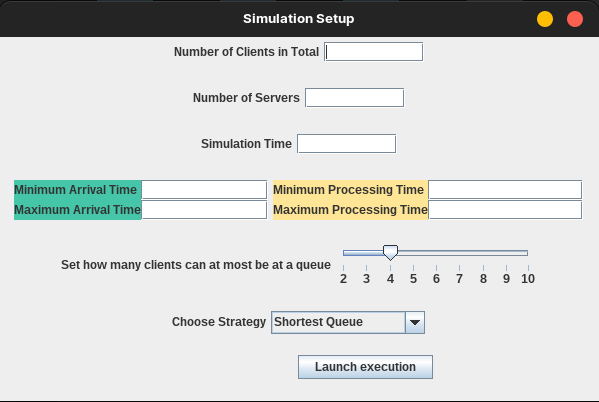
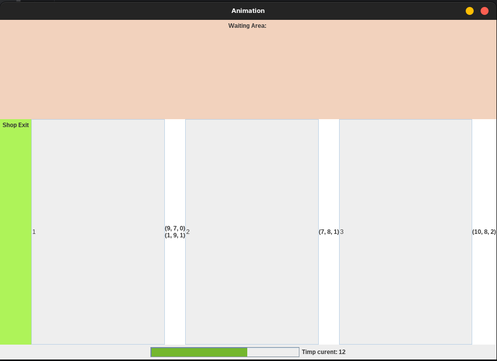

# Task Dispatcher

## Description
A multi-threaded task dispatcher simulator that can also be interpreted as clients being assigned in a shop.  
Tasks can be dispatched by either Shortest Queue or Shortest Processing Time.  

## Purpose
The project allows the user to set up the simulating conditions.  

Then it randomly generates tasks with respect to the current setup and dispathces tasks to
queues to be processed.
Possible operations:

## Modules
The following packages can be found under `src`, in `Task_dispatcher` folder:
- `BusinessLogic` (implements the logic aka backend of the program)
- `GUI` package (takes care of Animation and Simulation)
- `Models` package (contains Server and Task classes)
- `ro_tuc` package
    - `App.java` is the starting point of the application

The project also contains:
- `Media` folder with pictures during execution
- `Documentation_RO.pdf`, [link here](Documentation_RO.pdf)
- `Log.txt`, automatically generated during the execution

## Dependencies
Maven was used to ease dependency injection.